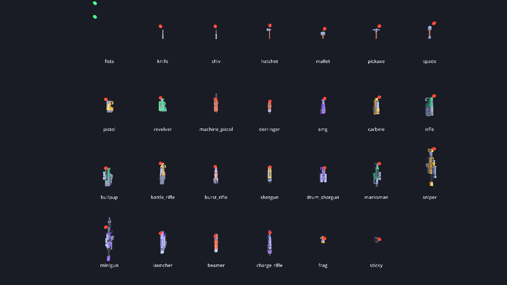

# zee-dot-weapons

A complete, networked weapons pack for the Dot ecosystem: **twenty-seven weapons** built on [dot-weapon](https://github.com/modcommunity/dot-weapon)'s catalogue, with first-person view models, third-person world models, procedural animation, and the replication that makes another player's weapon look right on your screen.

Art is Kenney's **Blaster Kit**, with melee from the Weapon Pack and Survival Kit and first-person hands from the Blocky Characters — all CC0, all vendored, nothing to download.



## What is in it

| Slot | Weapons |
| --- | --- |
| 1 · Melee | Fists, Knife, Shiv, Hatchet, Mallet, Pickaxe, Spade |
| 2 · Sidearm | Dart Pistol, Revolver, Machine Pistol, Derringer |
| 3 · Primary | SMG, Carbine, Assault Rifle, Bullpup, Battle Rifle, Burst Rifle, Shotgun, Drum Shotgun, Marksman Rifle |
| 4 · Heavy | Sniper Rifle, Minigun, Launcher, Beamer, Charge Rifle |
| 5 · Thrown | Frag Grenade, Sticky Charge |

Every blaster also has a **bash** on the alt-fire, so twenty of the twenty-seven have a second thing they can do.

They are not twenty-seven statistical variations on one gun. Each is an answer to a different question — the knife is the fastest thing in the pack, the mallet is the hardest single hit, the bullpup is the only weapon that stays accurate while you move, the beamer rewards tracking instead of aim, the minigun has no magazine at all and simply runs out. Seven ammunition pools are shared across families, so a box of darts on the floor is a decision rather than a formality.

## What it adds over dot-weapon

dot-weapon decides that a use happened and refuses to draw anything. That is the right split and it leaves a real gap: a weapon nobody can see. This pack is that half.

- **`ZeeWeaponPack`** — the twenty-seven rows, tuned in ticks, validated as one document a dedicated server can check at boot with no art installed.
- **`ZeeWeaponArtTable`** — the only file that knows a filename. Weapons are named by role, so replacing the art replaces one table and changes no rule, no loadout and no save.
- **`ZeeViewModel`** — the weapon in your own hands: arms, magazine, attachments, sway, bob, recoil, deploy, reload, charge.
- **`ZeeWorldModel`** — the weapon in somebody else's hands, hung off their character's hand attachment. Depth-tested, shadow-casting, the right size.
- **`ZeeWeaponPose`** — the animation arithmetic, with no `Node` in it, so a headless suite can assert that the springs settle and that nothing produces a `NaN`.
- **`ZeeWeaponNet`** — four small fields on top of dot-weapon's replication, so a watcher sees the gun move. A four-bit counter rather than an RPC per shot.
- **`ZeeWeaponRig`** — the one node a game adds per player, which wires all of the above in the order that works.

## Using it

Copy `addons/zee_weapons/` and `assets/` into your project, alongside `dot_core`, `dot_combat` and `dot_weapon`. Enable the plugin.

```gdscript
var rig := ZeeWeaponRig.new()
rig.role = ZeeWeaponRig.Role.LOCAL
rig.authority = true                       # false on a client that only predicts
rig.view_model_ref = DotNodeRef.of_path(view_model.get_path())
player.add_child(rig)
rig.setup()

rig.give(ZeeWeaponIds.RIFLE)
rig.give(ZeeWeaponIds.KNIFE)
```

Then once per simulation tick:

```gdscript
var outcome := rig.simulate_tick(command, tick)

for shot in outcome.shots:
    combat.resolve(shot)                   # dot-combat's, on the authority only
```

and once per render frame, for the sway and the bob:

```gdscript
rig.drive_view(Vector2(yaw, pitch), speed, on_floor, crouched)
```

That is the whole integration. The rig finds the player through `DotWeaponPlayerBridge`, which is duck-typed — nothing in this addon names a player class, a controller class or a netcode class, so it works with dot-player or with your own.

### Networking

```gdscript
# On the carrier's replicated object, once:
var specs := ZeeWeaponNet.all_specs()      # dot-weapon's three, plus this pack's four

# On the authority, each tick, after simulating:
rig.pull_net(replicated)

# On a watcher, each snapshot:
_seen = ZeeWeaponNet.apply(replicated, world_model, _seen)["seq"]
```

Ammunition stays owner-only, because exact magazine counts are information an opponent should not have. What is public is that a shot happened, which anybody in the room can see anyway.

### Rollback

`rig.snapshot()` and `rig.restore()` carry the arsenal, the bash cooldown, the charge and the previous command's buttons. Wrap a reconciliation replay in `rig.begin_replay()` / `rig.end_replay()` and the simulation re-runs while the drawing does not.

## Requirements

Godot **4.7**, and three addons: [dot-core](https://github.com/modcommunity/dot-core), [dot-combat](https://github.com/modcommunity/dot-combat) and [dot-weapon](https://github.com/modcommunity/dot-weapon). Everything else — dot-net, dot-player, dot-player-controller, dot-player-char — is optional and reached by duck typing.

Desktop, mobile and the browser from one build. Nothing here opens a socket, reads a clock, spawns a thread or touches `user://`.

## Running it

```bash
# A firing range you can walk around, holding any of the twenty-seven.
godot --path . res://examples/zee_range.tscn

# The headless suite: 14 sections, 133 checks.
godot --headless --path . res://examples/zee_selftest.tscn

# Every weapon at once, with a marker on each muzzle.
tools/screenshot.sh --rack
```

In the range: WASD to move, mouse to look, left click to fire, **right click to bash**, R to reload, 1–5 for the slots, Q for the last weapon, wheel to cycle, F1 to dump the rig's state.

## Licence

The code is MIT — see [LICENSE](LICENSE).

The art is **CC0 1.0** by [Kenney](https://kenney.nl), which asks for nothing and permits everything, including commercial use. The original licence text ships beside each kit in `assets/`. The kits used are the [Blaster Kit](https://kenney.nl/assets/blaster-kit), the Weapon Pack, the Survival Kit and the Blocky Characters; only the files actually referenced are vendored, which is 47 models and three textures at 1.7 MB.
